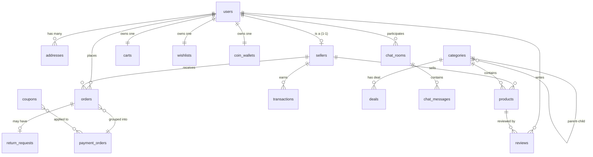

# 🗄️ Kế hoạch Thiết kế Database — TKart E-commerce

> Theo quy trình 6 giai đoạn chuẩn: **Requirements → Modeling → Schema → Indexes → Migration → Review**

---

## Giai đoạn 1: Requirements (Xác định yêu cầu)

> Thu thập Entities, Attributes, Constraints từ SRS (29 Use Cases).

### 1.1 Entities (Thực thể)

| # | Entity | Mô tả | Nguồn UC |
|---|--------|-------|----------|
| 1 | **User** | Tài khoản người dùng (Customer/Seller/Admin) | UC02,10,27,29 |
| 2 | **Address** | Địa chỉ giao hàng đa bản ghi | UC05,11 |
| 3 | **OtpToken** | Mã OTP xác thực 6 chữ số | UC02,27,29 |
| 4 | **Seller** | Hồ sơ gian hàng (GST, ngân hàng, kho) | UC14,19 |
| 5 | **Category** | Danh mục sản phẩm 3 cấp | UC01,15,21 |
| 6 | **Product** | Sản phẩm (biến thể, giá, ảnh) | UC01,15,20 |
| 7 | **Cart** | Giỏ hàng (1-1 với User) | UC03 |
| 8 | **Wishlist** | Danh sách yêu thích (1-1 với User) | UC04 |
| 9 | **Order** | Đơn hàng phụ (tách theo Seller) | UC05,06,16 |
| 10 | **PaymentOrder** | Lệnh thanh toán gộp | UC05 |
| 11 | **Coupon** | Mã giảm giá toàn sàn | UC05,22 |
| 12 | **Deal** | Khuyến mãi theo danh mục | UC01,22 |
| 13 | **CoinWallet** | Ví xu + lịch sử biến động | UC12,25 |
| 14 | **PlatformConfig** | Cấu hình tài chính động | UC25 |
| 15 | **Review** | Đánh giá sản phẩm (1-5 sao) | UC08 |
| 16 | **ReturnRequest** | Yêu cầu trả hàng + Dispute | UC09,17,23 |
| 17 | **Transaction** | Lịch sử giao dịch đối soát | UC18 |
| 18 | **ChatRoom** | Phòng chat 1-1 (Customer ↔ Seller) | UC13 |
| 19 | **ChatMessage** | Tin nhắn real-time | UC13 |
| 20 | **HomepageConfig** | Cấu hình trang chủ động | UC21 |
| 21 | **AuditLog** | Nhật ký kiểm toán (Read-only) | UC26 |
| 22 | **ShippingProvider** | Đơn vị vận chuyển | QĐ_AD10 |

### 1.2 Attributes (Thuộc tính chính)

> Chi tiết đầy đủ sẽ được triển khai ở **Giai đoạn 3 (Schema)**.

| Entity | Thuộc tính cốt lõi |
|--------|-------------------|
| User | fullName, email*, phone, password(BCrypt), role, status, authProvider, avatar |
| Address | userId, recipientName, phone, province, district, ward, detail, isDefault |
| OtpToken | email, code(6 số), type, expiresAt, used |
| Seller | userId*, shopName, gstNumber, bankDetails{}, pickupAddress{}, logo, banner, status |
| Category | name, slug, level(1/2/3), parentId(self-ref), image |
| Product | sellerId, title, description, categoryL3Id, mrpPrice, sellingPrice, discountPercent, color, sizes[], quantity, images[], status |
| Cart | userId*, cartItems[{productId, title, image, price, qty, size, color, sellerId}], totals |
| Wishlist | userId*, productIds[] |
| Order | userId, sellerId, paymentOrderId, orderItems[{snapshot}], totals, trackingId, status, deliveredAt |
| PaymentOrder | userId, orderIds[], subtotal, couponDiscount, coinDiscount, shippingFee, finalPayment, method, status |
| Coupon | code*, discountPercent, minOrderValue, validFrom, validTo, isActive |
| Deal | categoryId, discountPercent, title, image, isActive |
| CoinWallet | userId*, balance, transactions[{type, amount, orderId, date}] |
| PlatformConfig | coinEarnRate, coinValueRate, coinMaxUsagePercent, platformFeePercent |
| Review | userId, productId, orderId, rating(1-5), comment, images[] |
| ReturnRequest | orderId, userId, sellerId, reason, evidences[], status, sellerNote, adminNote |
| Transaction | sellerId, orderId, type, amount, description |
| ChatRoom | customerId, sellerId*, lastMessage, lastMessageAt |
| ChatMessage | chatRoomId, senderId, senderRole, content, isRead |
| HomepageConfig | banners[], electricCategories[], gridCategories[], shopByCategories[] |
| AuditLog | actorId, actorRole, action, targetType, targetId, details |
| ShippingProvider | name, code, apiEndpoint, apiKey, isActive |

> `*` = unique constraint

### 1.3 Constraints (Ràng buộc nghiệp vụ)

| Mã | Ràng buộc | Nguồn |
|----|----------|-------|
| C01 | Email unique, không đổi sau đăng ký | BR10-1 |
| C02 | OTP 6 chữ số, hiệu lực 5 phút, dùng 1 lần | BR27-1 |
| C03 | Password tối thiểu 8 ký tự, mã hóa BCrypt | BR29-1 |
| C04 | 1 Customer = 1 Cart, 1 Wishlist | BR03-1, BR04-1 |
| C05 | Sản phẩm thuộc đúng 1 Category Level 3 | BR15-1 |
| C06 | Sản phẩm mới mặc định PENDING | BR15-2 |
| C07 | Split Order: tách theo sellerId | BR05-2 |
| C08 | Final = Total - Coupon - Xu + Ship | BR05-3 |
| C09 | COD không dùng Xu | BR05-4 |
| C10 | Chỉ hủy đơn khi status = PLACED | BR06-2 |
| C11 | Hoàn trả trong 7 ngày từ DELIVERED | BR09-1 |
| C12 | Seller có 3 ngày phản hồi return | BR17-1 |
| C13 | Phán quyết Admin là cuối cùng | BR23-1 |
| C14 | Audit Log = Read-only tuyệt đối | BR26-1 |
| C15 | Chỉ review khi đơn DELIVERED | BR08-1 |
| C16 | Chat riêng tư 1 Customer ↔ 1 Seller | BR13-1 |

### 1.4 Enums cần định nghĩa

| Enum | Giá trị |
|------|---------|
| `Role` | ROLE_CUSTOMER, ROLE_SELLER, ROLE_ADMIN |
| `AccountStatus` | ACTIVE, SUSPENDED, BANNED |
| `AuthProvider` | LOCAL, GOOGLE, FACEBOOK |
| `SellerStatus` | PENDING_VERIFICATION, ACTIVE, SUSPENDED, BANNED |
| `ProductStatus` | PENDING, PUBLISHED, REJECTED |
| `OrderStatus` | PLACED, CONFIRMED, SHIPPED, DELIVERED, CANCELED, RETURN_REQUESTED, DISPUTED, REFUNDED |
| `PaymentMethod` | COD, VNPAY, SEPAY, MOMO |
| `PaymentStatus` | PENDING, SUCCESS, FAILED, COD_PENDING, COD_COLLECTED, REFUND_PENDING, REFUNDED |
| `OtpType` | REGISTER, LOGIN, RESET_PASSWORD |
| `ReturnStatus` | REQUESTED, SELLER_ACCEPTED, SELLER_REJECTED, DISPUTED, ADMIN_APPROVED, ADMIN_REJECTED, REFUNDED |
| `CoinTransactionType` | EARNED, SPENT |
| `TransactionType` | ORDER_PAYMENT, PLATFORM_FEE, REFUND, COIN_COMPENSATION |

---

## Giai đoạn 2: Modeling (Mô hình hóa)

> Vẽ ER Diagram, xác định Relationships và Cardinality.

### 2.1 ER Diagram



### 2.2 Relationships & Cardinality

| Quan hệ | Loại | Ghi chú |
|---------|------|---------|
| User → Addresses | 1 : N | Sổ địa chỉ đa bản ghi |
| User → Seller | 1 : 1 | Seller profile mở rộng từ User |
| User → Cart | 1 : 1 | Mỗi user 1 giỏ duy nhất |
| User → Wishlist | 1 : 1 | Mỗi user 1 wishlist |
| User → CoinWallet | 1 : 1 | Mỗi user 1 ví xu |
| User → Orders | 1 : N | 1 user nhiều đơn |
| Seller → Products | 1 : N | 1 gian hàng nhiều sản phẩm |
| Seller → Orders | 1 : N | 1 seller nhận nhiều đơn |
| Category → Category | Self-ref | Cây 3 cấp (parentId) |
| Category → Products | 1 : N | 1 danh mục L3 nhiều SP |
| Category → Deals | 1 : N | 1 danh mục nhiều deal |
| Orders → PaymentOrder | N : 1 | Split Order gộp thanh toán |
| Order → ReturnRequest | 1 : 0..1 | Tối đa 1 yêu cầu hoàn trả |
| User → Reviews | 1 : N | 1 user nhiều đánh giá |
| Product → Reviews | 1 : N | 1 SP nhiều đánh giá |
| ChatRoom → ChatMessages | 1 : N | 1 phòng nhiều tin nhắn |
| Customer ↔ Seller (ChatRoom) | N : N | Qua junction: chat_rooms |

### 2.3 Quyết định Embed vs Reference (MongoDB)

| Quyết định | Embed | Reference | Lý do |
|-----------|-------|-----------|-------|
| Cart ↔ CartItems | ✅ | | Luôn fetch cùng, 1-1 với User, tạm thời |
| Order ↔ OrderItems | ✅ | | Snapshot giá tại thời điểm mua |
| Seller ↔ BankDetails | ✅ | | 1-1, luôn fetch cùng |
| Seller ↔ PickupAddress | ✅ | | 1-1, luôn fetch cùng |
| CoinWallet ↔ CoinTransactions | ✅ | | Gắn chặt theo user, query cùng |
| Product → Category | | ✅ | Danh mục thay đổi độc lập |
| Order → User, Seller | | ✅ | Nhiều đơn cho 1 user/seller |
| Review → Product, User | | ✅ | Query theo cả 2 chiều |
| ChatRoom ↔ Messages | | ✅ | Messages rất nhiều, cần pagination |

---

## Giai đoạn 3: Schema (Thiết kế lược đồ)

> Chuyển mô hình thành cấu trúc MongoDB collections cụ thể với Spring Data annotations.

### Deliverables
- [ ] Abstract class `BaseDocument` (id, createdAt, updatedAt)
- [ ] 12 Enum classes trong `models/enums/`
- [ ] 22 Document classes trong `models/entities/`
- [ ] Embedded classes cho các sub-documents (CartItem, OrderItem, BankDetails, etc.)

### Công việc chi tiết
> Sẽ triển khai code Java Entity cho từng collection theo đúng thứ tự phụ thuộc:
> `Enums → BaseDocument → Users → Addresses → OtpTokens → Sellers → Categories → Products → Carts → Wishlists → Orders → PaymentOrders → Coupons → Deals → CoinWallets → PlatformConfigs → Reviews → ReturnRequests → Transactions → ChatRooms → ChatMessages → HomepageConfigs → AuditLogs → ShippingProviders`

---

## Giai đoạn 4: Indexes (Chỉ mục)

> Tối ưu hiệu suất dựa trên query patterns từ 29 Use Cases.

| Collection | Index | Loại | Query Pattern |
|-----------|-------|------|---------------|
| users | `email` | Unique | Đăng nhập, tìm user |
| addresses | `userId` | Regular | Lấy sổ địa chỉ |
| otp_tokens | `expiresAt` | TTL (auto-delete) | Tự xóa OTP hết hạn |
| otp_tokens | `email + type` | Compound | Tra cứu OTP theo email |
| sellers | `userId` | Unique | 1 user = 1 seller |
| categories | `parentId` | Regular | Query cây danh mục |
| categories | `level` | Regular | Lọc theo cấp |
| products | `sellerId` | Regular | SP của gian hàng |
| products | `categoryL3Id` | Regular | Lọc theo danh mục |
| products | `status` | Regular | Lọc SP đã duyệt |
| products | `sellingPrice` | Regular | Sắp xếp theo giá |
| carts | `userId` | Unique | 1 user = 1 cart |
| wishlists | `userId` | Unique | 1 user = 1 wishlist |
| orders | `userId` | Regular | Đơn hàng của tôi |
| orders | `sellerId + status` | Compound | Seller quản lý đơn |
| orders | `paymentOrderId` | Regular | Gộp thanh toán |
| payment_orders | `userId` | Regular | Lịch sử thanh toán |
| coupons | `code` | Unique | Áp dụng mã giảm giá |
| coupons | `validTo + isActive` | Compound | Voucher Engine quét |
| coin_wallets | `userId` | Unique | 1 user = 1 ví |
| reviews | `productId` | Regular | Xem đánh giá SP |
| reviews | `userId + productId` | Compound Unique | 1 review/SP/user |
| return_requests | `orderId` | Regular | Tra cứu hoàn trả |
| return_requests | `status` | Regular | Lọc theo trạng thái |
| transactions | `sellerId + createdAt` | Compound | Đối soát doanh thu |
| chat_rooms | `customerId + sellerId` | Compound Unique | 1 phòng chat/cặp |
| chat_messages | `chatRoomId + createdAt` | Compound | Lịch sử tin nhắn |
| audit_logs | `timestamp` | Regular (DESC) | Xem nhật ký mới nhất |

---

## Giai đoạn 5: Migration (Triển khai)

> Đưa thiết kế vào thực tế: tạo code Entity + seed data.

### 5.1 Tạo cấu trúc (DDL tương đương)
- [ ] Viết Java Entity classes với `@Document`, `@Id`, `@Indexed`
- [ ] Tạo Repository interfaces (`MongoRepository`)
- [ ] Spring Data MongoDB tự tạo collections khi app khởi động

### 5.2 Seed Data (Dữ liệu mẫu)
- [ ] **Admin mặc định**: 1 tài khoản ROLE_ADMIN
- [ ] **Categories**: Cây danh mục mẫu (Men/Women → Topwear/Footwear → T-Shirt/Heels)
- [ ] **PlatformConfig**: Cấu hình tài chính ban đầu (fee 5%, xu 1%)
- [ ] **ShippingProviders**: GHTK + Grab Express
- [ ] **HomepageConfig**: Banner + Grid mặc định

### 5.3 Thứ tự triển khai
```
Bước 1: Enums + BaseDocument
Bước 2: Users + Addresses + OtpTokens (Phase Core)
Bước 3: Sellers + Categories + Products (Phase Catalog)
Bước 4: Carts + Wishlists + Orders + PaymentOrders (Phase Commerce)
Bước 5: Coupons + Deals + CoinWallets + PlatformConfigs (Phase Promotion)
Bước 6: Reviews + ReturnRequests + Transactions (Phase Post-Sale)
Bước 7: ChatRooms + ChatMessages + HomepageConfigs + AuditLogs + ShippingProviders (Phase Platform)
Bước 8: DataSeeder (CommandLineRunner) — nạp dữ liệu mẫu
```

---

## Giai đoạn 6: Review (Kiểm tra & Đánh giá)

> Đảm bảo schema đáp ứng đúng yêu cầu SRS ban đầu.

### 6.1 Checklist toàn vẹn dữ liệu

| # | Kiểm tra | Tiêu chí |
|---|---------|---------|
| R01 | Email unique | Không tạo được 2 user cùng email |
| R02 | 1 User = 1 Cart = 1 Wishlist = 1 CoinWallet | Unique index hoạt động |
| R03 | 1 User = 1 Seller profile | sellers.userId unique |
| R04 | Cây Category 3 cấp | Query cha-con đúng |
| R05 | Product thuộc đúng 1 Category L3 | categoryL3Id hợp lệ |
| R06 | Split Order theo Seller | N orders → 1 paymentOrder |
| R07 | Snapshot giá trong OrderItem | Giá không đổi sau khi đặt |
| R08 | Coupon code unique | Không trùng mã |
| R09 | 1 Review / Product / User | Compound unique hoạt động |
| R10 | ChatRoom unique per pair | customerId + sellerId unique |

### 6.2 Kiểm tra truy vấn thực tế

| # | Truy vấn | Kỳ vọng |
|---|---------|---------|
| Q01 | Tìm user theo email | < 5ms (indexed) |
| Q02 | Lấy sản phẩm theo danh mục L3 + sắp xếp giá | < 50ms |
| Q03 | Lấy giỏ hàng của user | < 10ms (unique index) |
| Q04 | Lấy đơn hàng của Seller theo status | < 50ms (compound index) |
| Q05 | Voucher Engine quét coupon hợp lệ | < 100ms (NFR22-1) |
| Q06 | Lấy reviews của sản phẩm | < 50ms |
| Q07 | Lấy lịch sử chat | < 50ms (compound index + pagination) |
| Q08 | Homepage config API | < 20ms (singleton) |

### 6.3 Đối chiếu với SRS

| UC | Yêu cầu | Collection liên quan | Đủ? |
|----|---------|---------------------|------|
| UC01-UC29 | Tất cả 29 Use Cases | 22 collections | ☐ |
| RBAC | 3 roles phân quyền | users.role enum | ☐ |
| Split Order | Tách đơn theo Seller | orders + payment_orders | ☐ |
| Voucher Engine | Auto-apply coupon | coupons + payment_orders | ☐ |
| Hệ thống Xu | Tích/Tiêu xu | coin_wallets + platform_configs | ☐ |
| Return/Dispute | Luồng hoàn trả 3 bên | return_requests (7 status) | ☐ |
| Audit Log | Read-only, Async | audit_logs (no update/delete API) | ☐ |
