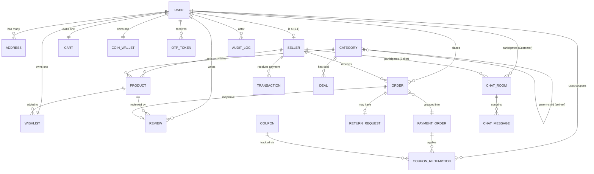

# Phase 2: Modeling (Mô hình hóa) — Final

> Xác định mối quan hệ giữa các thực thể, bản số (Cardinality) và chiến lược lưu trữ (Embed vs Reference) tối ưu cho MongoDB.

---

## 2.1 Sơ đồ ER (Entity Relationship Diagram)

---

## 2.2 Bảng quan hệ & Bản số (Relationships & Cardinality)

| Thực thể A | Thực thể B | Loại | Ghi chú |
|------------|------------|------|---------|
| **User** | **Address** | 1 : N | Một user có nhiều địa chỉ, một địa chỉ thuộc về một user. |
| **User** | **Seller** | 1 : 1 | Một user có thể đăng ký làm seller. |
| **User** | **Cart** | 1 : 1 | Giỏ hàng tồn tại song song với user. |
| **User** | **Wishlist** | 1 : 1 | Danh sách yêu thích của user. |
| **User** | **CoinWallet** | 1 : 1 | Ví xu gắn liền với tài khoản user. |
| **Seller** | **Product** | 1 : N | Một seller có nhiều sản phẩm. |
| **Category** | **Category** | 1 : N | Phân cấp danh mục (Cha -> Con). |
| **Category** | **Product** | 1 : N | Sản phẩm thuộc danh mục cấp 3. |
| **Order** | **PaymentOrder** | N : 1 | Nhiều đơn hàng phụ (tách theo seller) thuộc một lệnh thanh toán gộp. |
| **Order** | **ReturnRequest** | 1 : 0..1 | Mỗi đơn hàng có tối đa một yêu cầu hoàn trả. |
| **Coupon** | **CouponRedemption** | 1 : N | Một mã coupon có thể được dùng bởi nhiều user (nếu chưa hết lượt). |
| **ChatRoom** | **ChatMessage** | 1 : N | Một phòng chat chứa lịch sử tin nhắn. |

---

## 2.3 Chiến lược lưu trữ MongoDB (Embed vs Reference)

Dựa trên đặc thù của MongoDB và nhu cầu truy vấn từ 29 Use Cases.

### 2.3.1 Tại sao chọn Nhúng (Embed)?
Sử dụng khi dữ liệu luôn được truy xuất cùng nhau, dữ liệu nhỏ, hoặc cần snapshot (không thay đổi khi gốc thay đổi).

| Collection | Thành phần Nhúng | Lý do |
|------------|------------------|-------|
| **Cart** | `cartItems` | Luôn fetch cùng khi xem giỏ hàng. Số lượng item không quá lớn. |
| **Order** | `orderItems` | **Snapshot**: Phải lưu giá, tên SP tại thời điểm mua để tránh biến động sau này. |
| **Order** | `deliveryAddress`| **Snapshot**: Lưu địa chỉ tại thời điểm đặt để đối soát. |
| **Product** | `variants` | Biến thể là một phần không thể tách rời của SP khi hiển thị. |
| **Seller** | `bankDetails` | 1-1, luôn fetch cùng khi làm thanh toán/đối soát. |
| **CoinWallet** | `transactions` | Truy vấn lịch sử xu thường đi kèm với xem số dư. |

### 2.3.2 Tại sao chọn Tham chiếu (Reference)?
Sử dụng khi dữ liệu lớn (Unbound array), thay đổi độc lập, hoặc cần query từ nhiều phía.

| Collection | Thành phần Tham chiếu | Lý do |
|------------|-----------------------|-------|
| **Product** | `categoryL3Id` | Danh mục thay đổi độc lập, được dùng bởi hàng triệu SP. |
| **Order** | `userId`, `sellerId` | Cần query "Đơn của tôi" hoặc "Đơn của Shop". |
| **Review** | `productId`, `userId` | Cần xem "Review của SP này" hoặc "Review bởi User này". |
| **ChatRoom** | `messages` | Tin nhắn có thể lên tới hàng ngàn, cần phân trang (Pagination). |
| **Address** | `userId` | User có thể có nhiều địa chỉ, lưu collection riêng để dễ quản lý. |

---

## 2.4 Ràng buộc đặc biệt (Consistency Constraints)

1. **Atomic Default Address**: Khi cập nhật `isDefault = true` cho một địa chỉ, hệ thống phải đảm bảo các địa chỉ khác của User đó được set `isDefault = false` trong cùng một transaction.
2. **Stock Consistency**: Khi đặt hàng, `Product.variants.quantity` phải được trừ đi một cách atomic (sử dụng `$inc` với điều kiện `$gte`).
3. **Audit Log Integrity**: Mọi hành động nhạy cảm (cập nhật ví, thay đổi trạng thái đơn, ban seller) phải được ghi vào `AuditLog` và không cho phép API xóa/sửa.

---

## 2.5 Trạng thái Phase 2
- [x] ER Diagram (Mermaid)
- [x] Relationships & Cardinality
- [x] Embed vs Reference Strategy
- [x] Consistency Constraints

> **Tiếp theo**: Chuyển sang **Phase 3: Schema** để định nghĩa Java Class (Entities).
 
---
> **Người thực hiện**: Nguyễn Thành Tin 
