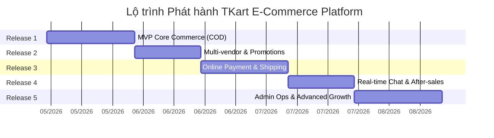

# Kế hoạch Tổng thể Phát triển & Phát hành (Master Release Plan) – TKart E-Commerce

Tài liệu này định nghĩa chiến lược phát hành tổng thể cho nền tảng thương mại điện tử đa nhà cung cấp **TKart (TKart E-Commerce Platform)**. Kế hoạch được chia thành **5 phiên bản phát hành (Releases)**, chuyển tiếp từ MVP cốt lõi đến một hệ sinh thái Marketplace hoàn chỉnh với các tính năng nâng cao (thanh toán trực tuyến, vận chuyển tự động, real-time chat, AI chatbot, và vận hành quản trị chuyên sâu).

---

## 1. Cấu trúc Thư mục Kế hoạch Phát hành (`plan/`)

Mỗi phiên bản phát hành được phân rã chi tiết trong một thư mục riêng biệt, bao gồm mục tiêu, danh sách User Story, phân rã công việc (WBS), quy tắc nghiệp vụ và kịch bản nghiệm thu (Demo/DOD):

*   📂 **`release-1-mvp-core-commerce/`**: [Release 1: MVP Core Commerce](./release-1-mvp-core-commerce/README.md) – Luồng mua bán cơ bản với phương thức thanh toán COD.
*   📂 **`release-2-multi-vendor-promotions/`**: [Release 2: Multi-vendor Checkout & Promotions](./release-2-multi-vendor-promotions/README.md) – Tách đơn hàng theo Seller (Split Order), tích hợp Voucher Engine và Ví Xu.
*   📂 **`release-3-online-payment-fulfillment/`**: [Release 3: Online Payment & Seller Fulfillment](./release-3-online-payment-fulfillment/README.md) – Thanh toán cổng trực tuyến (VNPay), Webhook đối soát và tích hợp Giao hàng (GHTK/Grab).
*   📂 **`release-4-realtime-after-sales/`**: [Release 4: Real-time Interaction & After-sales](./release-4-realtime-after-sales/README.md) – WebSockets Chat 1-1, AI Chatbot NLP, Đánh giá sản phẩm và Quy trình Trả hàng/Khiếu nại (Disputes).
*   📂 **`release-5-admin-ops-growth/`**: [Release 5: Admin Operations & Growth](./release-5-admin-ops-growth/README.md) – Quản trị vận hành sàn (Homepage config, Coupons/Deals, Audit Log, Báo cáo nâng cao và Security 2FA/OAuth2).

---

## 2. Nguyên tắc & Tiêu chuẩn Hoàn thành (Definition of Done - DoD)

Để đảm bảo chất lượng phần mềm và khả năng bàn giao liên tục (CI/CD), mỗi User Story trong từng Release phải đáp ứng trọn vẹn các tiêu chuẩn sau trước khi đóng:

1.  **Hoàn thành Acceptance Criteria (AC):** Đáp ứng 100% các kịch bản Given-When-Then (GWT) được định nghĩa trong `UserStory.md`.
2.  **Kiểm chứng Nghiệp vụ (Business Rules):** Tuân thủ chặt chẽ các ràng buộc nghiệp vụ (BR) tương ứng trong `requirements_final.md` (VD: BR05-2 về Split Order, BR26-1 về Audit Log).
3.  **Toàn vẹn Dữ liệu (Seed Data):** Bắt buộc có dữ liệu mẫu (Seed Data) chuẩn hóa trên MongoDB để phục vụ kiểm thử và Demo ngay lập tức.
4.  **Xử lý Ngoại lệ (Exception Handling):** Bắt và xử lý triệt để các trường hợp lỗi (VD: Hết tồn kho khi thanh toán, lỗi kết nối cổng thanh toán, token hết hạn, chặn truy cập Guest).
5.  **Chất lượng Code & NFRs:** Đảm bảo hiệu năng API, tối ưu hóa các câu truy vấn MongoDB (đã đánh index theo `indexes.md`), và giao diện UI/UX mượt mà, responsive trên các thiết bị.

---

## 3. Lộ trình Triển khai Tổng quan (Roadmap)

---

## 4. Bảng Tổng hợp Tương quan EPIC & Release

| Release | Tên Phiên bản | EPIC chính liên quan | Trọng tâm Kỹ thuật & Nghiệp vụ |
| :--- | :--- | :--- | :--- |
| **Release 1** | MVP Core Commerce | EPIC 1, EPIC 2, EPIC 3, EPIC 4 | Đăng ký/Đăng nhập cơ bản, Khám phá sản phẩm, Giỏ hàng, Checkout COD, Quản lý đơn hàng cơ bản, Duyệt Seller/Product. |
| **Release 2** | Multi-vendor & Promotions | EPIC 2, EPIC 3 | Tách đơn hàng đa nhà cung cấp (Split Order), Thuật toán Voucher Engine, Tích hợp thanh toán bằng Ví Xu, Wishlist. |
| **Release 3** | Online Payment & Shipping | EPIC 3, EPIC 4 | Tích hợp VNPay/IPN Webhook, Giao tiếp API GHTK/Grab sinh Tracking ID tự động, Quản lý Fulfillment của Seller. |
| **Release 4** | Real-time & After-sales | EPIC 1, EPIC 5 | WebSockets Chat 1-1, Tích hợp AI NLP Chatbot, Đánh giá (Review) sản phẩm, Luồng Trả hàng (Return) & Trọng tài Khiếu nại (Disputes). |
| **Release 5** | Admin Ops & Growth | EPIC 2, EPIC 4, EPIC 6 | Cấu hình động Homepage (JSON), Quản lý chiến dịch Coupon/Deals, Quản trị User, Bảng Audit Log Read-only, Báo cáo Excel, OAuth2 & 2FA. |

---

## 5. Hướng dẫn Sử dụng Thư mục Kế hoạch

Khi bắt đầu một Sprint hoặc Release mới, Đội ngũ Phát triển (Dev Team) và Quản lý Dự án (PM) cần thực hiện:
1.  Truy cập vào thư mục `plan/release-X-...` tương ứng.
2.  Đọc kỹ phần **Phân rã Công việc (WBS)** để gán việc (assign tasks) cho Backend và Frontend.
3.  Đối chiếu các **Quy tắc Nghiệp vụ (BR)** và **Tiêu chí Nghiệm thu (AC)** để viết Unit Test và Integration Test.
4.  Thực hiện kịch bản Demo (Vertical Slice) cuối Release để nghiệm thu với Product Owner (PO).
